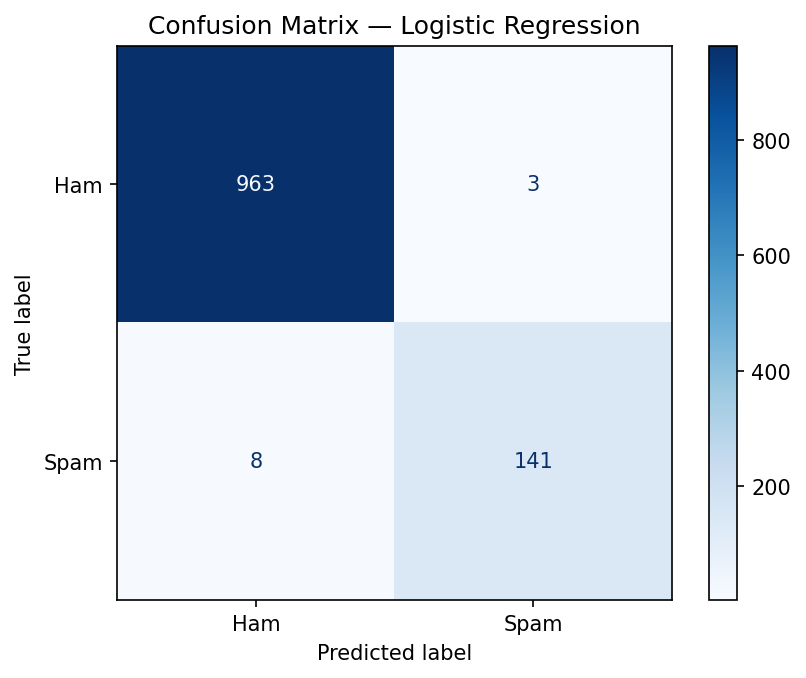
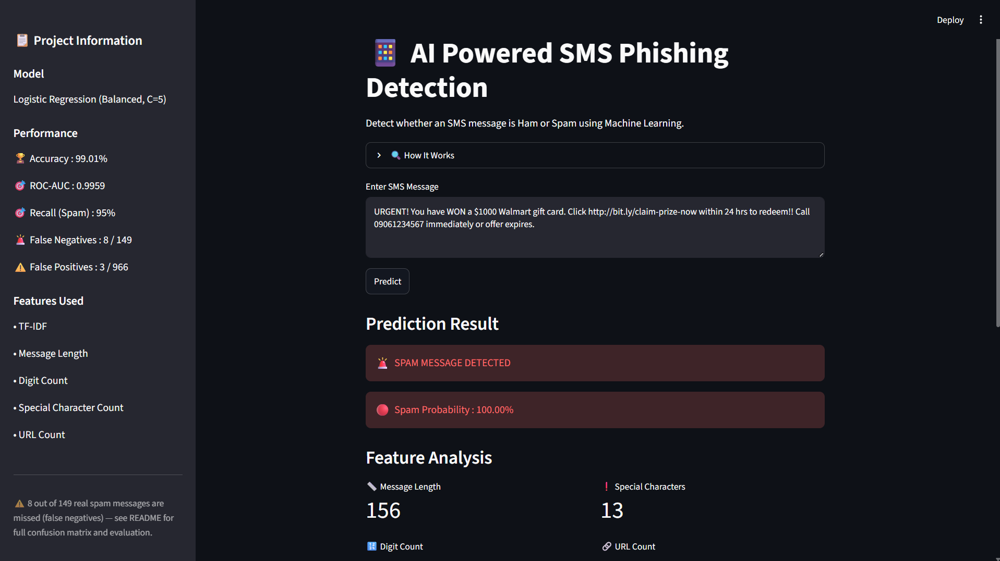
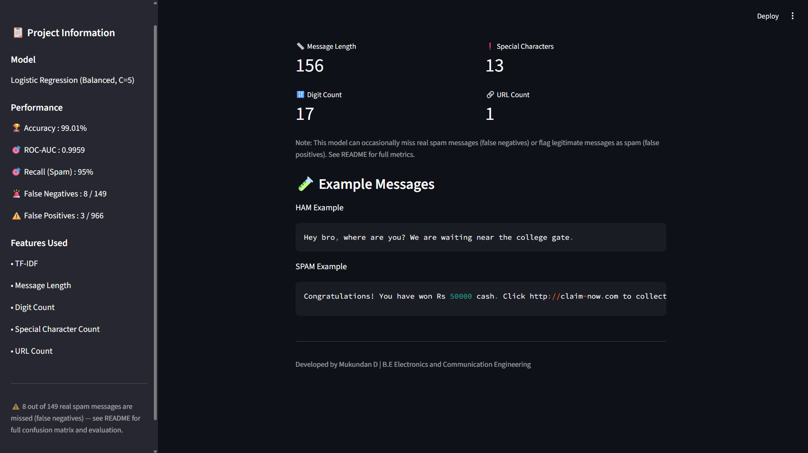

# 📱 AI-Powered SMS Phishing Detection

An end-to-end Machine Learning project that classifies SMS messages as
Ham or Spam using TF-IDF, hand-crafted features, and Logistic Regression,
deployed as an interactive Streamlit web app.

---

## Problem

Phishing and spam SMS messages are a common attack vector for fraud.
This project explores whether message content and structural patterns
(length, digit count, special characters, URLs) can reliably distinguish
phishing/spam messages from legitimate ones.

---

## Dataset

SMS Spam Collection Dataset — 5,574 labeled SMS messages (Ham/Spam).

---

## Approach

Two models were trained and compared:

| Model | Accuracy | Recall (Spam) |
|---|---|---|
| Multinomial Naive Bayes | 97.40% | 85% |
| **Logistic Regression (Balanced, C=5)** | **99.01%** | **95%** |

Logistic Regression was selected as the final model. Class weights were
balanced to counter the natural imbalance between ham and spam messages
in the dataset (966 ham vs. 149 spam in the test set).

**Features used:**
- TF-IDF vectorization of message text
- Message length
- Digit count
- Special character count
- URL count

---

## Results

**Final Model Performance (test set, n=1115):**

| Metric | Value |
|---|---|
| Accuracy | 99.01% |
| ROC-AUC | 0.9959 |
| Precision (Spam) | 0.98 |
| Recall (Spam) | 0.95 |
| F1-score (Spam) | 0.96 |



|  | Predicted Ham | Predicted Spam |
|---|---|---|
| **Actual Ham** | 963 | 3 |
| **Actual Spam** | 8 | 141 |

---

## ⚠️ Limitations

- **8 false negatives**: 8 out of 149 real spam messages (~5%) were
  missed and classified as ham. In a phishing-detection context, this
  is the more dangerous error type, since a missed phishing message
  could still reach and deceive a user.
- **3 false positives**: 3 legitimate messages were flagged as spam —
  low impact, but a minor usability cost.
- The dataset (SMS Spam Collection) is small and relatively old; messages
  reflect spam patterns from that era and may not generalize perfectly
  to newer phishing tactics (e.g., more sophisticated social engineering
  with no obvious spam keywords or URLs).

---

## Tech Stack

Python · Pandas · NumPy · Scikit-Learn · NLTK · SciPy · Streamlit · Pickle

---

## Project Structure
AI-SMS-Phishing-Detection/

├── App/

│   └── app.py

├── Dataset/

│   └── SMSSpamCollection

├── Models/

│   ├── spam_model.pkl

│   └── tfidf_vectorizer.pkl

├── src/

│   ├── data_preprocessing.py

│   ├── train_model.py

│   ├── evaluate.py

│   └── main.py

├── SMS_Phishing_ProjectFinal.ipynb

├── confusion_matrix.png

├── app_screenshot.png

├── app_screenshot1.png

├── requirements.txt

└── README.md
---

## App Preview




---

## How to Run Locally

```bash
git clone https://github.com/mukundan1012-creator/AI-SMS-Phishing-Detection.git
cd AI-SMS-Phishing-Detection
pip install -r requirements.txt
streamlit run App/app.py
```

To retrain the model from scratch:
```bash
cd src
python main.py
```

---

## If I Rebuilt This Today

I would test the model against more recent phishing message examples
(not just this dataset's era), add a feature-importance plot to show
which engineered features contribute most, and explore whether a
neural network (e.g., a simple LSTM) improves recall on the false
negatives without significantly increasing false positives.

---

## Author

**Mukundan D**
B.E. Electronics and Communication Engineering